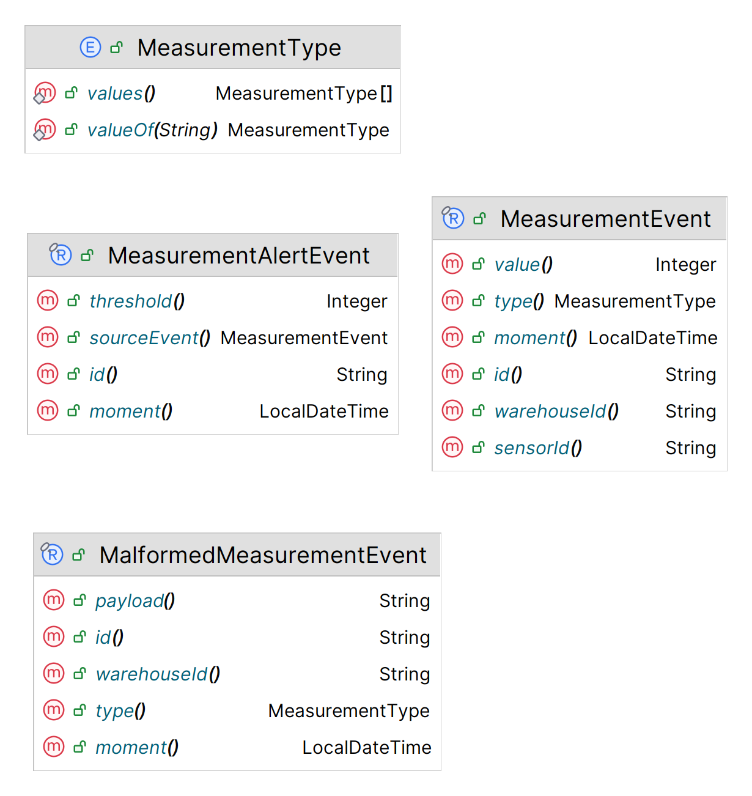

# Getting Started

### Reference Documentation for Sensors Watch Project

The objective of this project is to provide a reliable and observable architecture to consume UPD
events from temperature and humidity sensors, centralize it and to notify exceed thresholds.

The project was divided into three pieces:

* Monitoring Service - Contains all details of monitoring and alerting.
* Warehouse Service - Gather temperature and humidity events and put it on Kafka Topic.
* Sensors Schema - The temperature and humidity events schema.

## Schema



## Solution


### Apache Kafka Topics

* **temperature-measurements-data** - Contains temperature measurements.
* **humidity-measurements-data** - Contains humidity measurements.
* **malformed-measurements-data** - Contains malformed temperature and humidity payloads.
* **humidity-measurements-alert-data** - Contains high temperature alerts.
* **temperature-measurements-alert-data**- Contains high humidity alerts.

All topics above have a DLT (Death Letter Topic) that receive unprocessed messages.  
The DTL topic has the suffix -dlt, for example: **humidity-measurements-data-dlt**.

# Running
## Requirements
* Require Docker and Docker Compose plugin

## Run the solution
````shell
docker compose up --build --force-recreate
````
Having problems? The command below can help, **but it will delete all your containers**.
````shell
docker stop $(docker ps -a -q) && docker rm $(docker ps -a -q)
````

### Send a Temperature Event
````shell
echo "sensor_id=temp1;value=36" | nc -u localhost 3344
````

### Send a Humidity Event
````shell
echo "sensor_id=hum1;value=51" | nc -u localhost 3345
````

## TODO List

- [x] Warehouse Service;
- [x] Monitoring Service;
- [x] Measurement Schema;
- [x] IT Tests;
- [x] Unit Tests;
- [ ] Observability;
- [ ] Fallback;
- [ ] Logs;
